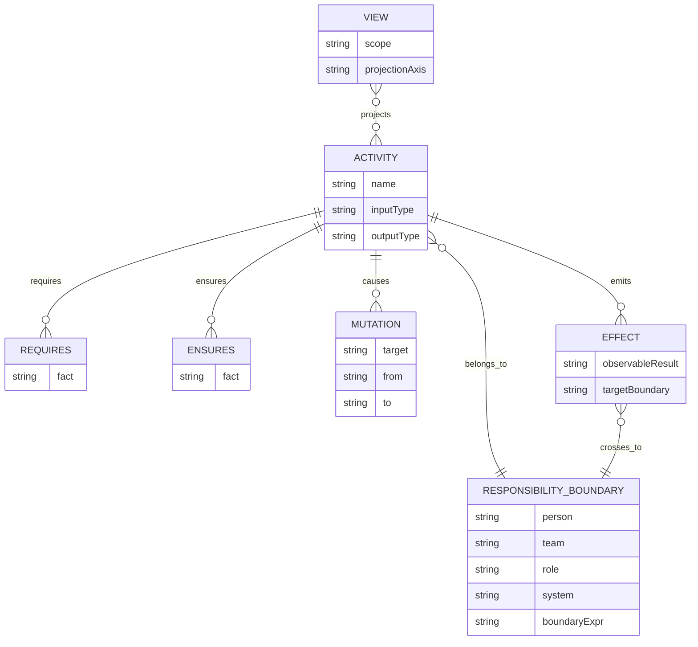
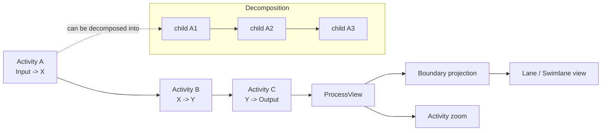
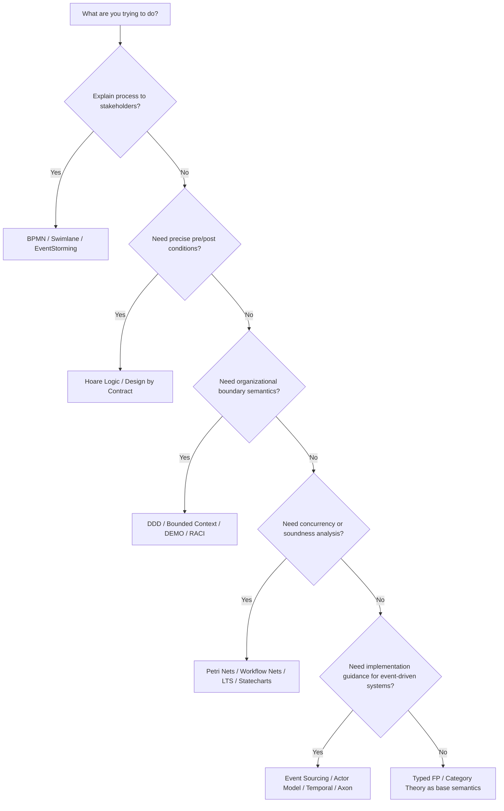

# Research Report on the Theoretical and Practical Foundations of `responsible`

English | [日本語](research-report.ja.md)

> Note: This file is retained as background research. The normative semantic rules are in `docs/semantic-core.md`, and the curated implementation-oriented theory mapping is in `docs/theory.md`.

## Executive summary

`responsible` is a modeling system that describes business processes centered on the composition of `Activity<Input, Output>`, rather than placing BPMN itself at the center.
Responsibility attributes and the Responsibility Boundary are attached to Activities, and views resembling lanes or swimlanes are projected afterward.
The README and public documentation treat an Activity as a typed function, explaining `requires` as the precondition for starting, `ensures` as the established fact upon completion, and `effects` as the result that becomes observable across a Responsibility Boundary.
State transitions are not the primary subject from the outset; rather, they are derived from a sequence of Activities.
The initial implementation emphasizes pure functions and plain objects, treating `ProcessModel -> ProcessView`, Activity-decomposition zoom, Responsibility-Boundary zoom, Responsibility Boundary Normal Form projection, and lane display as an external view.
The current v0 is limited to linear flows.

The theoretical backbone supporting this design consists of typed functional programming, compositionality from category theory, Hoare Logic and Design by Contract, DDD's Bounded Context, and Petri Nets and Workflow Nets.
Typed functional programming and category theory support the ideas of `Activity<Input, Output>`, composition, the hiding of internal intermediate types, and projection onto a view.
Hoare Logic and Design by Contract support the semantics of `requires` and `ensures`.
DDD gives organizational meaning to the Responsibility Boundary.
Petri Nets and Workflow Nets provide a foundation for soundness, reachability, and verifiability beyond mere syntactic description.

However, not everything in `responsible` maps directly onto existing literature.
It is more accurate to treat "Responsibility Boundary Normal Form," "boundary-relative Effects," and "a minimal vocabulary that takes established facts rather than mutation as its subject" as a repository-specific synthesis that connects multiple theories.
Related theories exist, but no identical formulation has been found at this time.
The README needs to clearly state the boundary between "parts that can be substantiated by existing theory" and "repository-specific hypotheses."

For explaining practical adoption, BPMN, swimlanes, EventStorming, RACI, IDEF0, DEMO and LAP, Activity Theory, and Systems Thinking can be used.
BPMN and RACI alone are weak as a core for formal verification or semantics.
On the other hand, Petri Nets or Hoare Logic alone tend to lack explanatory power in practice.
As a description to register in the repository, a stable three-layer structure emerges: an explanatory layer with BPMN, EventStorming, and RACI; a semantic layer with typed FP, Design by Contract, and DDD; and a verification layer with Petri Nets, Workflow Nets, and LTS.

## Design hypotheses of `responsible` observable from the repository

As far as can be confirmed from the published README, `docs/activity-effects.md`, `docs/data-and-effects.md`, and `docs/reference-implementation.md`, the center of `responsible` is the position that "everything is an Activity."
An Activity is read as a typed function `Input -> Output`.
A parent Activity is treated as the composition of its child Activities.
Start and End are boundaries of a view.
A Trigger is the output of an external or not-yet-expanded Activity.
Gateways and branching decisions are also treated as Activities.
This policy eliminates special symbols from the internal model as much as possible.

At the same time, the repository explains that it is not "data that changes by itself" but "an Activity that changes Data."
`Mutation` is an internal change.
`Effect` is a result that becomes observable across a Responsibility Boundary.
The same occurrence can be either an internal mutation or an external effect, depending on the zoom level.
Therefore, Effect is not an absolute concept but a boundary-relative one.
This design places its center of gravity on responsibility, observation, and disclosability, rather than on ordinary CRUD description or simple event-log description.

This stance is also consistent in the implementation policy.
The public documentation keeps core runtime dependencies at zero, and exposes pure functions and JSON-serializable plain data structures as the external API.
The view is placed downstream as `ProcessModel -> ProcessView`.
Activity-decomposition zoom and Responsibility-boundary zoom are independent axes.
Boundary projection targets leaf Activities, collapsing same-boundary runs for display on lanes.
The current v0 targets only linear flows, leaving branching, merging, and parallelism to a future graph quotient projection.

At this stage, `responsible` can be positioned as "a minimal implementation of a typed activity algebra sensitive to Responsibility Boundaries, together with a view for its projection."
BPMN runtimes, persistence, DSL parsers, layout engines, and server frameworks are intentionally placed outside the core.
In the theoretical explanation, stating explicitly that "this is not a BPMN-replacement runtime but an Activity-centered semantic core" reduces the risk of misreading.

## Mapping by theory family

### Typed functional programming

`Activity<Input, Output>`, the policy of treating a parent Activity as the composition of its child Activities, and the hiding of internal intermediate types all fit onto the basic vocabulary of typed FP.
The README itself puts forward `Activity<Input, Output>` and function composition `Process = C ∘ B ∘ A`.
The public documentation also gives a reading close to `Activity : World -> (World, Effect[])`.
Representative references include Haskell's standard report, Backus's functional style, and Hughes's paper on modularity.
Implementation examples close to this are typed function-composition systems such as Haskell, Scala, and Arrow-kt.
Candidate citations for the repository are `Marlow et al., Haskell 2010 Language Report`, `Backus 1978`, and `Hughes 1989`.

### Category theory and compositionality

The idea in `responsible` that "arranging activities in sequence gives rise to a larger activity" is consistent with category theory, which centers on the composition of morphisms and associativity.
The idea of viewing a large Activity from outside, with internal intermediate types hidden, is close to the composition and abstraction of morphisms.
Representative references include the founding paper by Eilenberg and Mac Lane, Mac Lane's standard textbook, and Fong and Spivak's applied category theory.
As supporting lines for implementation and practice, Haskell's `Category` and `Arrow` abstractions and high-level DSLs such as Context Mapper are close.
Candidate citations for the repository are `Eilenberg and Mac Lane 1945`, `Mac Lane 1978`, and `Fong and Spivak 2019`.

### Design by Contract and Hoare Logic

`requires` and `ensures` correspond directly to the Hoare triple and to Design by Contract.
Hoare Logic gives the basis for proving pre- and post-conditions of a program.
Meyer's Design by Contract translated that basis into contracts readable in practice, cast in terms of preconditions, postconditions, and invariants.
`requires` in `responsible` is "the condition of the world under which it is permissible to start."
`ensures` is "the fact that holds after completion."
These two can be treated as paraphrases of precondition and postcondition.
Implementation examples are Eiffel, JML and OpenJML, and SPARK and Ada.
Candidate citations for the repository are `Hoare 1969`, `Meyer 1992`, and `Cok et al. / OpenJML`.

### DDD and Bounded Context

The Responsibility Boundary is not merely an organizational chart.
Read as a boundary that cuts across which model, language, and rules are valid, it corresponds well to DDD's Bounded Context.
In Evans's definition, a bounded context is the boundary within which a particular model is defined and applied.
In the repository too, responsibility is handled by attaching attributes such as person, team, role, and system to an Activity.
The boundary in `responsible` is broader than DDD's bounded context, also encompassing organizational responsibility and display projection.
That said, the theoretically shortest path is DDD.
Implementation examples are Context Mapper, Context Mapping, and Axon's support for DDD and CQRS.
Candidate citations for the repository are `Evans 2003/2015`, `Fowler 2014 Bounded Context`, and `Kapferer et al. 2020 Context Mapper`.

### Actor Model and Process Algebra

The idea of treating an Effect as "a result that becomes observable across a boundary" is a good fit with message-passing between actors and the interaction descriptions of process algebra.
The Actor Model provides a computational model in which independent agents cooperate through message passing.
CSP and CCS handle communication, synchronization, hiding, and observable behavior.
The boundary-crossing Effect of `responsible` is close to the actor and process view, in that it takes external interaction rather than internal mutation as its subject.
Implementation examples are Akka, Akka.NET, and the actor pattern in XState.
Candidate citations for the repository are `Hewitt, Bishop, Steiger 1973`, `Hoare 1985 / 1984`, and `Milner 1989`.

### Labeled Transition Systems and State Machines

The repository states that it "does not directly take state transition as its subject; state transition arises from the composition of Activities."
This stance does not deny state machines.
It is a stance that treats state transition as a secondary, derived view.
LTS, statecharts, and SCXML can be used as a derived view or execution view.
Harel statecharts provide hierarchy, concurrency, and visualization.
Implementation examples are XState, SCXML, and itemis CREATE.
Candidate citations for the repository are `Harel 1987`, `W3C SCXML 2015`, and `itemis CREATE docs`.

### Event Sourcing and EventStorming

The fact that `responsible` writes "established facts" and their effects rather than mutation has an affinity with Event Sourcing.
Event Sourcing stores state changes as a sequence of events, making it possible to reconstruct past states and trace history.
EventStorming is a workshop format for collaboratively exploring a complex business domain in an event-centric way.
It is well suited to process discovery and to extracting candidate bounded contexts.
`responsible` is not Event Sourcing itself.
However, it becomes easy to connect the two if `ensures` is treated as a domain fact and `effects` as an observable publication.
Implementation examples are EventStoreDB, Axon Framework, and Temporal.
Candidate citations for the repository are `Fowler 2005`, `Brandolini 2013- / official book`, and `Overeem et al. 2021 lessons from industry`.

### Petri Nets and Workflow Nets

The theories that give `responsible` a foothold for formal verification are Petri Nets and Workflow Nets.
Petri Nets handle concurrency, synchronization, and reachability.
Workflow Nets handle the soundness of business flows.
The repository's v0 is a linear flow, but if it advances to future branching, merging, and parallel activities, a back-and-forth with Workflow Nets is theoretically promising.
Implementation examples are ProM, WoPeD, and workflow-net analyzers.
Candidate citations for the repository are `Petri 1962`, `van der Aalst 1998`, and `van der Aalst et al. 2011`.

### BPMN and lane / swimlane

The repository does not aim to be a BPMN-compatible runtime.
That said, it clearly aims for a display close to lanes and swimlanes.
BPMN is positioned by the OMG as a de facto standard that stakeholders can read directly and that can be translated into software process components.
It is therefore natural to give the view layer of `responsible` a BPMN-style lane display.
However, BPMN is not the semantic core; it is best used as a layer for visualization and shared language.
Implementation examples are Camunda Modeler, the bpmn-js family, and Signavio-family tools.
Candidate citations for the repository are `OMG BPMN 2.0.2`, `White / Wohed et al.`, and `Camunda BPMN docs`.

### RACI

RACI is effective for explaining the introduction of the Responsibility Boundary.
RACI is a responsibility-assignment table that organizes Responsible, Accountable, Consulted, and Informed for tasks and deliverables.
It is strong for making responsibilities visible.
However, it does not provide types, composition, verification, or state derivation.
Therefore it should be positioned not as the meaning layer of `responsible`, but as an aid for communication and governance.
Practical examples are PMI's Responsibility Assignment Matrix and RACI charts in various project-management tools.
Candidate citations for the repository are `PMI Responsibility Assignment Matrix`, `Smith and Erwin RACI`, and `PMBOK RAM references`.

### IDEF0

IDEF0 is a function-modeling standard that expresses functions in terms of input, control, output, and mechanism.
It is effective as an auxiliary means for organizing `Activity<Input, Output>`, responsibility, reference rules, and observation targets.
`requires` in `responsible` is close to IDEF0's control.
Input and output are close to input and output as-is.
Responsibility is close to mechanism.
However, IDEF0 does not sufficiently express compositional semantics or boundary-crossing effects.
Implementation examples are IDEF0-compliant EA tools and modeling software.
Candidate citations for the repository are `FIPS PUB 183`, `ICAM IDEF0`, and `IDEF0 tool conformance docs`.

### Activity Theory

The repository's position of "describing changes in the world centered on activity" corresponds to Activity Theory.
The view of mediated activity — subject, tool, object, community, division of labor, and rules — can explain the Responsibility Boundary, roles, system attributes, and organizational view.
However, Activity Theory is stronger for organizational change, learning, and contradiction analysis than for formal specification.
Practical examples are the Change Laboratory, developmental work research, and interventions in education, healthcare, and business-process improvement.
Candidate citations for the repository are `Engeström 1987`, `Engeström 2001`, and `Virkkunen and Newnham 2013 / Change Laboratory`.

### DEMO and LAP

The view that responsible parties establish facts through promise, request, acceptance, and fulfillment is close to DEMO and the Language-Action Perspective.
DEMO captures the essence of an organization as a chain of commitment, authority, responsibility, and competence between human beings.
Reading `ensures` in `responsible` as an "established fact" and `effects` as "a result that becomes observable in another boundary" makes it easy to connect with the DEMO transaction pattern.
Examples of implementation and practice are DEMOworld, DEMO tooling from the Enterprise Engineering Institute, and LAP-family communication modeling.
Candidate citations for the repository are `Dietz 1999/2006/2024`, `Winograd and Flores 1987`, and `Schoop 2001`.

### Systems Theory and Cybernetics

For `responsible`, which emphasizes boundary, feedback, observation, and control, systems theory and cybernetics can also serve as a foundational explanation.
Bertalanffy thematized systems consisting of interacting parts.
Wiener thematized control and communication.
The idea in `responsible` of cutting a Responsibility Boundary, defining Effect in terms of observability, and switching views through zoom and projection can be explained with the vocabulary of system boundary, feedback, and control.
Practical examples are Vensim, STELLA, and systems-thinking tools in general.
Candidate citations for the repository are `von Bertalanffy 1968`, `Wiener 1948`, and `Vensim / STELLA systems thinking docs`.

### projection / view / Responsibility Boundary Normal Form

This part has strong repository-specific character, and agreement with existing literature is only partial.
The repository documentation states that leaf Activities are projected onto a selected boundary, and that a graph with same-boundary runs collapsed is displayed on lanes.
Related theories are the abstraction and compositional view of category theory, the hiding and abstraction of process algebra, and workflow graph quotienting.
However, the specific formulation "Responsibility Boundary Normal Form" itself should be regarded as specific to the repository.
It is academically honest for the README to state explicitly that this is "a new name inspired by existing theory."

## Effectiveness and limitations from empirical research

There is a rich body of empirical research on business process modeling.
7PMG synthesizes empirical research on process-model comprehension and, working from the premise that "the same behavior can be transformed into a model that is easier to understand," presents guidelines for improving understandability.
A systematic literature review organizes much of the research on business-process-modeling quality as concentrated on understandability and readability.
The same review also states that while BPMN and EPC are frequently used in empirical studies, a comprehensive, agreed-upon quality framework is still lacking.
From this result, it seems reasonable that `responsible` should first provide value as an explanatory model that improves understandability, and add formalization afterward — that is, this adoption order is appropriate.

BPMN has standardization by the OMG and broad practical adoption.
However, on the research side, BPMN is not regarded as an all-purpose notation capable of neatly expressing everything.
Suitability evaluations against Workflow Patterns discuss both the applicability and the limitations of BPMN.
Readability research also shows that richness of expression does not always directly translate into ease of understanding.
Therefore, the approach taken by `responsible` — simplifying the semantic core and relegating BPMN mainly to the view layer — is consistent with findings from empirical research.

Event Sourcing has both practical benefits and practical liabilities.
As Fowler explains, storing the entire history of changes as events makes it possible to reconstruct past states and to handle things retroactively.
On the other hand, surveys of industrial cases raise schema evolution, learning cost, skills shortage, projection rebuilding, and data privacy as ongoing issues.
Therefore, even if `responsible` incorporates Event Sourcing, it does not end simply by mapping "established facts" or `Effect` directly onto an event store.
Schema evolution and the projection lifecycle need to be spelled out explicitly.

There is also a gap between theory and implementation for contract-based specification.
Design by Contract is strong as semantics for preconditions and postconditions.
However, empirical research raises issues such as "how many contracts developers actually write in practice," "which contracts they could write but do not," and "how to combine static verification with runtime assertion checking."
When introducing `requires` and `ensures` into `responsible` as well, it is more realistic to start from concise statements of facts, statements of responsibility, and representative invariants, rather than fully formalizing everything at once.

Industrial use of actor models and state machines is abundant.
The point at issue here is where `responsible` should be positioned relative to them.
Akka and XState are strong as execution foundations that provide concurrency, orchestration, and execution semantics.
However, the repository's reference-implementation policy states that it keeps the core as a boring pure model and leaves runtimes and UI to external adapters.
Therefore, actor runtimes and state-machine runtimes are not the core of `responsible` itself.
It is correct to treat these as downstream implementations serving as a projection target or an execution target.

## Comparison table

The following table summarizes the material based on the repository's public text, the original works, standards, and official materials of each theory, and empirical research on usage and modeling quality.
The maturity of each theory takes into account both academic maturity and degree of practical adoption.

| Theory                         | Core idea                                                       | Correspondence to `responsible`                                                        | Maturity                       | Recommended use                           | repo-ready citation strings                                                                                                                                                                    |
| ------------------------------- | ----------------------------------------------------------------- | -------------------------------------------------------------------------------------------- | -------------------------------- | ------------------------------------------- | -------------------------------------------------------------------------------------------------------------------------------------------------------------------------------------------------- |
| Typed FP                       | Typed functions and composition                                  | `Activity<Input,Output>`, parent-child composition, hiding of internal intermediate types    | mature                           | explanatory / internal semantics          | `Marlow et al. Haskell 2010 Language Report (2010)`; `Backus, Can Programming Be Liberated from the von Neumann Style? (1978)`; `Hughes, Why Functional Programming Matters (1989)`            |
| Category Theory                | Composition of morphisms and abstraction                         | Activity composition, abstract view of projection, source of inspiration for the normal form | mature                           | explanatory / formalization               | `Eilenberg & Mac Lane, General Theory of Natural Equivalences (1945)`; `Mac Lane, Categories for the Working Mathematician (1978)`; `Fong & Spivak, Seven Sketches in Compositionality (2019)` |
| Hoare Logic / DbC              | Preconditions and postconditions                                 | Semantics of `requires` / `ensures`                                                          | mature                           | formal verification / internal discipline | `Hoare, An Axiomatic Basis for Computer Programming (1969)`; `Meyer, Applying "Design by Contract" (1992)`; `Cok, OpenJML: Software verification for Java ... (2014)`                          |
| DDD / Bounded Context          | Boundary of a model's scope of validity                          | Organizational and semantic boundary of the Responsibility Boundary                          | mature                           | explanatory / internal architecture       | `Evans, Domain-Driven Design (2003)`; `Evans, Domain-Driven Design Reference (2015)`; `Fowler, Bounded Context (2014)`                                                                         |
| Actor Model / Process Algebra  | Inter-agent messages and communicative behavior                  | Boundary-crossing Effect, interaction between responsible parties                            | mature                           | internal semantics / execution mapping    | `Hewitt et al., A Universal Modular ACTOR Formalism (1973)`; `Hoare, Communicating Sequential Processes (1985)`; `Milner, Communication and Concurrency (1989)`                                |
| LTS / Statecharts              | State transitions and observable transitions                     | State-transition view derived from a sequence of Activities                                  | mature                           | visualization / execution / verification  | `Harel, Statecharts (1987)`; `W3C, SCXML (2015)`; `Brookes-Hoare-Roscoe, A Theory of CSP (1984)`                                                                                               |
| Event Sourcing                 | Retaining a history of state changes                              | `ensures` and established facts, mapping to event history / projection                       | mature-practice / mixed-theory   | internal implementation / auditability    | `Fowler, Event Sourcing (2005)`; `Overeem et al., Event Sourced Systems ... Lessons from Industry (2021)`; `Overeem et al., The Dark Side of Event Sourcing (2017)`                            |
| EventStorming                  | Collaborative exploration workshop                                | Domain discovery, discovery of candidate boundaries                                          | mature-practice                  | explanatory / discovery workshops         | `Brandolini, Introducing EventStorming (official book)`; `EventStorming official site`; `Brandolini, EventStorming Process Modelling template`                                                 |
| Petri Nets / Workflow Nets     | Concurrency, synchronization, soundness verification              | Formalizing branching / merging / parallelism, soundness                                     | mature                           | formal verification                       | `Petri, Kommunikation mit Automaten (1962)`; `van der Aalst, The Application of Petri Nets to Workflow Management (1998)`; `van der Aalst et al., Soundness of Workflow Nets (2011)`           |
| BPMN / Swimlane                | Standard notation for stakeholders                                | Lane / swimlane view, explanatory diagrams                                                   | mature                           | visualization / communication             | `OMG, BPMN 2.0.2 (2014)`; `Wohed et al., On the Suitability of BPMN for Business Process Modelling`; `Camunda BPMN docs`                                                                       |
| RACI                           | Responsibility-assignment table                                   | Aid for boundary explanation and division of responsibility                                  | mature-practice                  | explanatory / governance                  | `PMI, Responsibility Assignment Matrix`; `Smith & Erwin, Role & Responsibility Charting (RACI)`; `PMBOK Guide references`                                                                      |
| IDEF0                          | Describing functions with ICOM                                    | Auxiliary notation for Input / Control / Output / Mechanism                                  | mature                           | explanatory / documentation               | `NIST FIPS PUB 183, IDEF0 (1993)`; `ICAM IDEF0 manual`; `FIPS conformance note`                                                                                                                |
| Activity Theory                | Capturing social practice centered on activity                    | Explaining Activity subjects, tools, division of labor, contradictions                       | mature                           | explanatory / organizational analysis     | `Engeström, Learning by Expanding (1987)`; `Engeström, Expansive Learning at Work (2001)`; `Virkkunen & Newnham, The Change Laboratory (2013)`                                                 |
| DEMO / LAP                     | The essence of an organization through commitment and action      | Established facts, request / acceptance / fulfillment, responsible parties                  | mature in niche                  | explanatory / enterprise modeling         | `Dietz, DEMO: Towards a Discipline of Organisation Engineering (1999)`; `Dietz, Enterprise Ontology (2006/2024)`; `Winograd, A language/action perspective ... (1987)`                         |
| Systems Theory / Cybernetics   | System boundaries, interaction, control                           | Boundary, observation, feedback, zoom/view                                                   | mature                           | explanatory / systemic framing            | `von Bertalanffy, General System Theory (1968)`; `Wiener, Cybernetics (1948)`; `Systems Thinking / Vensim docs`                                                                                |

## Proposed README additions and mermaid diagrams

The following proposed additions are draft text for separating, without changing the repository's current design policy, the parts "supported by existing theory" from the parts "presented as repository-specific hypotheses."
They connect `Activity<Input,Output>`, `requires`, `ensures`, `effects`, the Responsibility Boundary, view projection, and RBNF into a single coherent piece of writing.

```md
## Theoretical position

`responsible` is an Activity-centered modeling approach.

Its semantic core is intentionally smaller than BPMN.
The model starts from typed Activities and their composition:

    Activity<Input, Output>

An Activity is not merely a data operation.
It is a responsibility-bearing unit of work performed inside a Responsibility Boundary.

This repository adopts the following distinctions:

- `requires`: facts that must already hold for an Activity to start responsibly
- `ensures`: facts that are guaranteed to hold after successful completion
- `effects`: results that become observable across a Responsibility Boundary
- `mutation`: an implementation-level internal data change caused by an Activity

In that sense, `responsible` is theoretically close to:

- typed functional composition
- Hoare logic / Design by Contract
- Domain-Driven Design and bounded contexts
- actor/message-oriented interaction models
- workflow verification traditions such as Petri nets / workflow nets

At the same time, concepts such as `Responsibility Boundary Normal Form` are currently repository-specific terms.
They are inspired by existing abstraction and projection ideas, but should be treated as an explicit proposal of this project.
```

Placing the following short theory-mapping table in the README lets readers immediately grasp "what is this closest to?"

```md
## Theory mapping

| responsible concept         | Closest theories                                        |
| --------------------------- | ------------------------------------------------------- |
| `Activity<Input,Output>`    | Typed FP, category-theoretic composition                |
| Activity decomposition      | functional composition, hierarchical process modeling   |
| `requires` / `ensures`      | Hoare logic, Design by Contract                         |
| Responsibility Boundary     | DDD bounded context, DEMO actor roles, RACI             |
| `effects` across boundaries | Actor model, process algebra, event-driven architecture |
| state as derived trace      | LTS, state machines, statecharts                        |
| workflow verification       | Petri nets, workflow nets                               |
| lane/swimlane view          | BPMN, responsibility-oriented visualization             |
```

It would be good to separate a bibliography file out into its own file in the repository.
As a minimal setup, it is manageable to place the core references in `docs/bibliography.bib`, with the README linking only to short citation-key references.
Below is a starter set.

```bibtex
@article{Hoare1969,
  author = {C. A. R. Hoare},
  title = {An Axiomatic Basis for Computer Programming},
  journal = {Communications of the ACM},
  year = {1969},
  doi = {10.1145/363235.363259}
}

@article{Meyer1992,
  author = {Bertrand Meyer},
  title = {Applying "Design by Contract"},
  journal = {Computer},
  year = {1992},
  doi = {10.1109/2.161279}
}

@book{Evans2015,
  author = {Eric Evans},
  title = {Domain-Driven Design Reference},
  year = {2015},
  publisher = {Domain Language}
}

@article{Harel1987,
  author = {David Harel},
  title = {Statecharts: A Visual Formalism for Complex Systems},
  journal = {Science of Computer Programming},
  year = {1987},
  doi = {10.1016/0167-6423(87)90035-9}
}

@article{vanDerAalst1998,
  author = {Wil M. P. van der Aalst},
  title = {The Application of Petri Nets to Workflow Management},
  journal = {Journal of Circuits, Systems and Computers},
  year = {1998}
}

@misc{OMG_BPMN_2020_2,
  author = {{Object Management Group}},
  title = {Business Process Model and Notation (BPMN) Version 2.0.2},
  year = {2014},
  howpublished = {Formal Specification}
}

@book{MacLane1978,
  author = {Saunders Mac Lane},
  title = {Categories for the Working Mathematician},
  year = {1978},
  doi = {10.1007/978-1-4757-4721-8}
}

@book{FongSpivak2019,
  author = {Brendan Fong and David I. Spivak},
  title = {An Invitation to Applied Category Theory: Seven Sketches in Compositionality},
  year = {2019},
  publisher = {Cambridge University Press}
}
```

The following diagrams summarize the repository's design intent at a granularity that can be placed in the README or docs.
Their content follows the vocabulary of the published README and docs.







## Open questions and research topics

The largest open point is the strict definition of Responsibility Boundary Normal Form.
From the published documentation, it can be read that the core is the boundary projection of leaf Activities and the collapsing of same-boundary runs.
It can also be read that the future concept treats branching, merging, and parallel activities as a graph quotient projection.
However, the equivalence relation, uniqueness of the normal form, information preservation, and invertibility have not yet been defined.
It would be better to make this explicit as a literate spec.

The second open point is the level at which Effect is typed.
In the current docs, `Effect` is defined as a boundary-relative observable result.
However, whether it is treated as a message type, a domain-event type, a publication-contract type, or an observation-predicate type changes how it connects to downstream implementations.
Here, a decision needs to be made about which of the actor model, Event Sourcing, or Design by Contract to lean toward.

The third open point is how state, history, and data transformation are handled.
The repository relegates mutation to an implementation view.
However, as empirical research on Event Sourcing systems shows, issues such as schema evolution, projection rebuilding, and privacy cannot be ignored.
If `responsible` is to have an event-based implementation adapter in the future, the schema change for `ensures` and the versioning policy for `Effect` need to be defined in a separate document.

The open research questions can be summarized into the following three.

First, is RBNF a "normal form," a "projected view," or a "quotient semantics"?

Second, is `Effect` an event, a message, or a publishable established fact?

Third, when extending from the linear v0 to branching, merging, and parallelism, which semantics — Petri Nets, Workflow Nets, statecharts, or process algebra — should be treated as canonical?

If these can be made explicit, `responsible` will be easier to position not as "a BPMN-like visualization tool" but as "a model with semantics for the composition of Activities carrying Responsibility Boundaries."
