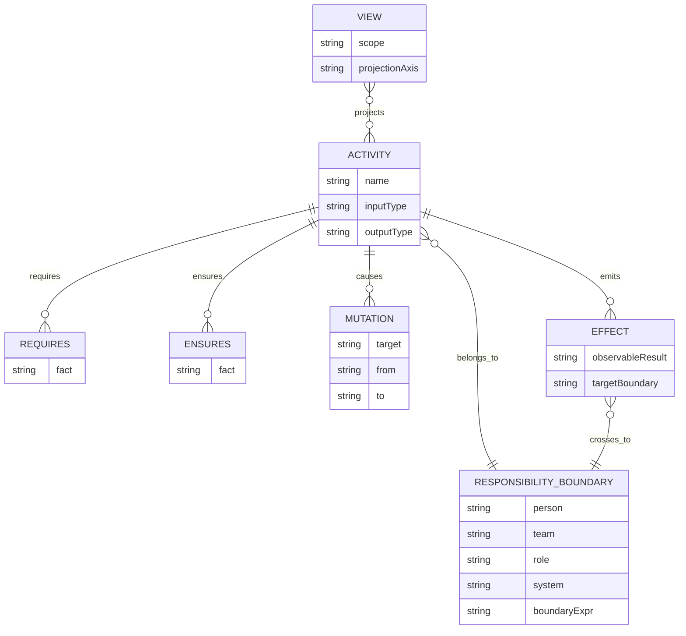
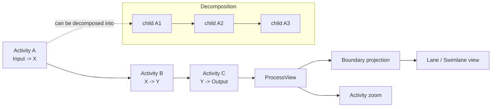
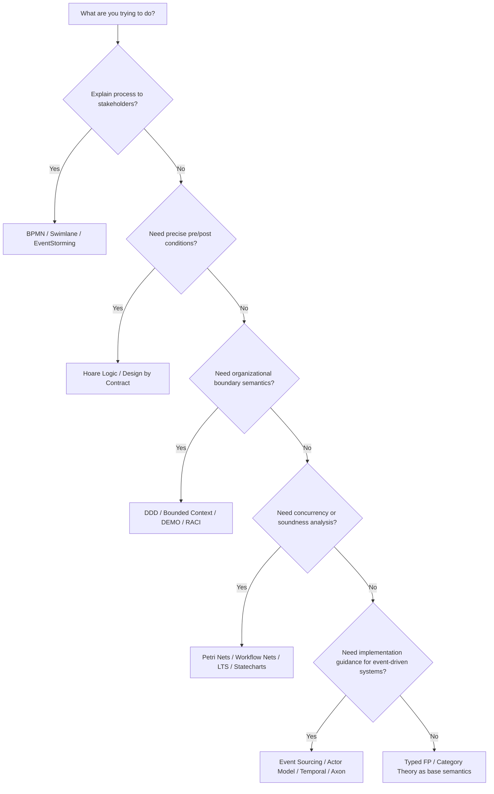

# responsible の理論的・実践的基盤に関する調査報告

## エグゼクティブサマリー

`responsible` は、BPMN そのものを中心に置くのではなく、`Activity<Input, Output>` の合成を中心に業務プロセスを記述し、責任属性と責任境界に応じて後から lane / swimlane 的な view を投影する実験的モデリング系として読める。README と公開ドキュメントでは、Activity を typed function と見なし、`requires` を開始前提、`ensures` を成立事実、`effects` を責任境界を越えて観測可能になる結果として明示し、状態遷移は Activity の並びから導出されるものだと説明している。初期実装は pure function と plain object を重視し、`ProcessModel -> ProcessView`、Activity 分解 zoom、責任境界 zoom、Responsibility Boundary Normal Form 投影、lane 表示を外部 view として扱う方針で、v0 は線形フローに限定されている。 citeturn42view0turn10view0turn10view1turn10view2

この設計を最も強く支える理論的背骨は、型付き関数型プログラミング、カテゴリー理論の合成、Hoare Logic / Design by Contract、DDD の Bounded Context、Petri Net / Workflow Net である。型付き FP とカテゴリー理論は `Activity<Input, Output>`、合成、内部中間型の隠蔽、view への射影という発想に適合し、Hoare / DbC は `requires` / `ensures` の意味論を自然に支える。DDD は Responsibility Boundary の組織的意味付けを与え、Petri / Workflow Net は構文記述を越えた健全性・到達性・検証可能性の足場になる。 citeturn40view0turn40view1turn36view1turn35view0turn35view1turn34view3turn34view4turn17search18

一方で、`responsible` の中には既存文献にそのままの名前で対応しない要素もある。とくに「Responsibility Boundary Normal Form」「境界相対的な Effect」「mutation ではなく成立事実を主語にする最小語彙」は、既存理論の単純な焼き直しではなく、複数理論を接合した独自の統合提案として理解するのが妥当である。近縁理論は存在するが、厳密に同一の定式化は現時点で見当たらないため、ここは「既存理論で裏づけ可能な部分」と「repo 独自仮説」の境界を README に明記するのが望ましい。 citeturn10view0turn10view1turn10view2turn36view1turn16search17

実務面では、BPMN / swimlane、EventStorming、RACI、IDEF0、DEMO / LAP、Activity Theory、Systems Thinking は、`responsible` を説明・導入・合意形成するうえで有用である。ただし形式検証や意味論の核としては BPMN や RACI だけでは弱く、逆に Petri Net や Hoare Logic だけでは現場説明性が不足しやすい。したがって `responsible` を repo に登録する際は、**説明層**として BPMN / EventStorming / RACI、**意味論層**として typed FP / DbC / DDD、**検証層**として Petri / Workflow Net / LTS を重ねる三層構成が最も安定している。 citeturn34view0turn37view0turn39view4turn35view0turn35view1turn34view3turn34view4turn36view5

## リポジトリから確認できる responsible の設計仮説

公開されている README、`docs/activity-effects.md`、`docs/data-and-effects.md`、`docs/reference-implementation.md` から確認できる範囲では、`responsible` の中心は「すべては Activity」という立場である。Activity は `Input -> Output` の typed function として読まれ、親 Activity は子 Activity の合成として扱われる。Start / End は view の境界であり、Trigger は外部または未展開 Activity の output、Gateway や分岐判定もまた Activity として扱う方針で、内部モデルから特別記号をできるだけ排除している。 citeturn42view0turn10view0

同時に、repo は「データが自分で変化する」のではなく「Activity が Data を変化させる」とし、`Mutation` を内部変化、`Effect` を責任境界を越えて観測可能になる結果だと区別している。さらに、同じ出来事が zoom level によって内部 mutation にも外部 effect にもなりうると説明しており、Effect を絶対概念ではなく boundary-relative な概念として扱っている。これは通常の CRUD 記述や単純な event-log 記述よりも、責任・観測・公開可能性に重心を置いた設計である。 citeturn10view1turn10view0

実装方針でもこの立場は一貫している。公開ドキュメントでは core runtime dependencies を 0 とし、純粋関数と JSON 直列化可能な plain data structure を外部 API とし、view は `ProcessModel -> ProcessView` として downstream に置く。さらに Activity decomposition zoom と Responsibility boundary zoom を独立軸とし、boundary projection では leaf Activity を対象に same-boundary run を collapse して lane 上に表示するという考え方が示されている。v0 はあえて線形フローのみを対象にし、分岐・合流・並列は将来の graph quotient projection に委ねている。 citeturn10view2

そのため、現段階の `responsible` を最も正確に表す言い方は、**「責任境界に敏感な typed activity algebra と、その投影 view のための最小実装」**である。逆に言えば、BPMN runtime、永続化、DSL parser、layout engine、server framework は intentionally core の外に追い出されているので、repo の理論説明でも「これは BPMN 代替 runtime ではなく、Activity 中心の semantic core である」と明示した方が誤読を避けやすい。 citeturn10view2turn42view0

## 理論ファミリ別マッピング

**型付き関数型プログラミング**  
`Activity<Input, Output>`、親 Activity を子 Activity 合成として扱う方針、内部中間型の隠蔽は、まさに typed FP の基礎語彙に乗る。README 自体が `Activity<Input, Output>` と関数合成 `Process = C ∘ B ∘ A` を掲げ、公開ドキュメントも `Activity : World -> (World, Effect[])` に近い読みを与えている。代表文献としては Haskell の標準報告、Backus の functional style、Hughes の modularity 論文が適切である。実装例としては Haskell、Scala、Arrow-kt のような型付き関数合成系が近い。repo へ入れる引用候補は `Marlow et al., Haskell 2010 Language Report`, `Backus 1978`, `Hughes 1989` がよい。 citeturn42view0turn10view0turn40view0turn14search2turn14search0turn28search1turn28search19

**カテゴリー理論と compositionality**  
`responsible` の「活動を並べるとより大きな活動が立ち上がる」という発想は、射の合成とその結合律を核心に置くカテゴリー理論と整合的である。特に内部中間型を外から隠したまま大きな Activity として観る発想は、morphism の合成と抽象化という見方に近い。代表文献としては Eilenberg–Mac Lane の創始論文、Mac Lane の標準教科書、Fong–Spivak の applied category theory が妥当である。実装・実践例としては Haskell の `Category` / `Arrow` 抽象や、Context Mapper のような高水準 DSL の compositional thinking が補助線になる。repo 引用候補は `Eilenberg and Mac Lane 1945`, `Mac Lane 1978`, `Fong and Spivak 2019`。 citeturn36view1turn40view2turn40view3turn40view1turn37view1

**Design by Contract と Hoare Logic**  
`requires` / `ensures` は最も直接的には Hoare triple と DbC に対応する。Hoare はプログラム前後条件の証明基盤を与え、Meyer はそれを現場で読める契約として前提・事後保証・不変条件に落とし込んだ。`responsible` における `requires` は「開始してよい世界の条件」、`ensures` は「完了後に成立する事実」であり、ほぼ precondition / postcondition の言い換えである。実装例は Eiffel、JML / OpenJML、SPARK / Ada が代表的で、repo 引用候補は `Hoare 1969`, `Meyer 1992`, `Cok et al. / OpenJML`。 citeturn35view0turn35view1turn36view6turn37view2turn27search9

**DDD と Bounded Context**  
Responsibility Boundary は、単なる組織図ではなく、どの model / language / rule が有効かを切る境界として読むと DDD の Bounded Context とよく対応する。Evans の定義では bounded context は特定モデルが定義・適用される境界であり、repo でも responsibility は person / team / role / system といった属性を Activity に付与する形で扱われている。`responsible` の boundary は DDD の bounded context より広く、組織責任と表示投影も含むが、理論的な最短距離は DDD である。実装例は Context Mapper、Context Mapping、Axon の DDD/CQRS 支援である。repo 引用候補は `Evans 2003/2015`, `Fowler 2014 Bounded Context`, `Kapferer et al. 2020 Context Mapper`。 citeturn34view3turn40view5turn13search21turn37view1turn27search8turn37view3

**Actor Model と Process Algebra**  
Effect を「境界を越えて観測可能になる結果」とみなす発想は、actor 間メッセージ送信や process algebra の相互作用記述と相性がよい。Actor Model は独立した主体が message passing で連携する計算モデルを与え、CSP / CCS は通信・同期・隠蔽・観測可能挙動を正確に扱う。`responsible` の boundary crossing effect は、内部 mutation ではなく対外相互作用を主語にする点で actor/process worldview に近い。実装例は Akka、Akka.NET、XState の actor 模式である。repo 引用候補は `Hewitt, Bishop, Steiger 1973`, `Hoare 1985 / 1984`, `Milner 1989`。 citeturn35view2turn16search17turn16search14turn38view2turn23search10turn38view3

**Labeled Transition Systems と State Machines**  
repo は「状態遷移を直接主語にしない。Activity の合成として状態遷移が立ち上がる」と述べる。この立場は state machine を否定するのではなく、state transition を二次的・導出的 view とみなすものである。LTS, statechart, SCXML は derived view / execution view としてきわめて相性がよく、特に Harel statecharts は階層化・並行性・可視化を与える。実装例は XState、SCXML、itemis CREATE である。repo 引用候補は `Harel 1987`, `W3C SCXML 2015`, `itemis CREATE docs`。 citeturn10view0turn16search6turn34view7turn38view3turn38view4

**Event Sourcing と EventStorming**  
`responsible` が mutation ではなく「成立した事実」とその effect を書く点は、Event Sourcing と親和的である。Event Sourcing は状態変更を event の系列として保存し、過去状態再構成や履歴追跡を可能にする。一方、EventStorming は複雑な業務領域を event 中心に共同探索する workshop 形式で、プロセス発見や bounded context 候補の抽出に向く。`responsible` は Event Sourcing そのものではないが、`ensures` を domain fact、`effects` を observable publication として扱うと接続しやすい。実装例は EventStoreDB、Axon Framework、Temporal である。repo 引用候補は `Fowler 2005`, `Brandolini 2013- / official book`, `Overeem et al. 2021 lessons from industry`。 citeturn40view4turn37view0turn40view6turn36view7turn39view0turn37view3turn38view1

**Petri Nets と Workflow Nets**  
`responsible` に最も強い形式検証の足場を与えるのは Petri Net / Workflow Net である。Petri net は並行・同期・到達可能性を、workflow net は業務フローの soundness を扱える。repo の v0 は線形フローだが、将来の branching / merging / parallel activities に進むなら workflow net との往復が理論的に非常に有力である。実装例は ProM、WoPeD、workflow-net analyzers。repo 引用候補は `Petri 1962`, `van der Aalst 1998`, `van der Aalst et al. 2011`。 citeturn36view0turn34view4turn17search18turn37view4turn37view5

**BPMN と lane / swimlane**  
repo は BPMN 互換 runtime を目指していないが、lane / swimlane 的表示は明確に志向している。BPMN は stakeholder が直接読め、かつ software process component に翻訳可能な de facto standard と OMG が位置付けているので、`responsible` の view 層に BPMN 的 lane 表示を与えるのは自然である。ただし BPMN は意味論の核ではなく可視化と共有言語の層として使うのがよい。実装例は Camunda Modeler、bpmn-js 系、Signavio 系である。repo 引用候補は `OMG BPMN 2.0.2`, `White / Wohed et al.`, `Camunda BPMN docs`。 citeturn34view0turn39view1turn39view2turn17search17

**RACI**  
Responsibility Boundary の導入説明には RACI が有効である。RACI はタスクや成果物に対する Responsible / Accountable / Consulted / Informed を整理する責任割当表で、責務の見える化には強い。ただし、型・合成・検証・状態導出は与えないため、`responsible` の meaning layer ではなく communication / governance 補助として位置づけるべきである。実務例は PMI の責任割当行列、各種 project management tool の RACI chart である。repo 引用候補は `PMI Responsibility Assignment Matrix`, `Smith and Erwin RACI`, `PMBOK RAM references`。 citeturn39view4turn20search0turn21search0

**IDEF0**  
IDEF0 は機能を input / control / output / mechanism で表す関数モデリング標準であり、`Activity<Input, Output>` と責任・参照ルール・観測対象を整理する補助手段として有効である。`responsible` の `requires` は IDEF0 の control、input / output はそのまま入出力、responsibility は mechanism に近い。ただし IDEF0 は合成意味論や境界越え effect を十分には表現しない。実装例は IDEF0 対応 EA ツールやモデリングソフトである。repo 引用候補は `FIPS PUB 183`, `ICAM IDEF0`, `IDEF0 tool conformance docs`。 citeturn34view5turn18search8

**Activity Theory**  
repo が「世界の変化を活動中心に書く」とする点は、Activity Theory と響き合う。とくに主体、道具、対象、共同体、分業、ルールという mediated activity の見方は、責任境界・役割・system attribute・organizational view を豊かに説明できる。もっとも、Activity Theory は形式仕様よりも組織変革・学習・矛盾分析に強い。実践例は Change Laboratory、発達的活動研究、教育・医療・業務改善の介入である。repo 引用候補は `Engeström 1987`, `Engeström 2001`, `Virkkunen and Newnham 2013 / Change Laboratory`。 citeturn35view6turn18search9turn31search19turn31search12

**DEMO と LAP**  
責任ある主体が約束・依頼・受諾・履行を通じて事実を成立させるという見方は、DEMO とその基盤である Language-Action Perspective に非常に近い。DEMO は organisation の本質を、人間同士の commitment と authority / responsibility / competence の連鎖として捉える。`responsible` の `ensures` を「成立事実」、`effects` を「他境界で観測可能になる結果」と読むと、DEMO transaction pattern と親和性が高い。実装・実践例は DEMOworld、Enterprise Engineering Institute の DEMO tooling、LAP 系 communication modelling である。repo 引用候補は `Dietz 1999/2006/2024`, `Winograd and Flores 1987`, `Schoop 2001`。 citeturn41search2turn34view6turn37view6turn37view7turn19search3turn41search13

**Systems Theory と Cybernetics**  
boundary, feedback, observation, control を重視する `responsible` には、systems theory / cybernetics も基底説明として使える。Bertalanffy は相互作用する部分からなる system を、Wiener は control and communication を主題化した。`responsible` で responsibility boundary を切り、effect を観測可能性で定義し、view を zoom / projection で切り替える発想は、システム境界・フィードバック・制御という観点から説明できる。実務例は Vensim、STELLA、systems thinking ツール群である。repo 引用候補は `von Bertalanffy 1968`, `Wiener 1948`, `Vensim / STELLA systems thinking docs`。 citeturn41search15turn41search0turn18search3turn38view5turn39view5

**projection / view / Responsibility Boundary Normal Form**  
ここは最も重要な独自部分であり、既存文献との一致は部分的である。repo ドキュメントは、leaf Activity を selected boundary で投影し、same-boundary run を collapse した graph を lane に表示する、と述べている。これは closest match としては、カテゴリー理論の abstraction / compositional view、process algebra の hiding / abstraction、workflow graph quotienting に近いが、「Responsibility Boundary Normal Form」という定式名そのものは repo 固有とみなすべきである。README では、この点を「既存理論から着想を受けた新規命名」と明記するのが学術的に誠実である。 citeturn10view2turn36view1turn16search17

## 実証研究から見える有効性と限界

business process modeling については、経験研究が最も厚い。7PMG は process model comprehension に関する実証研究を統合し、「同じ振る舞いでもより理解しやすいモデルに変形できる」という前提で、理解しやすさを高める指針を提示している。さらに systematic literature review では、business process modeling quality 研究の多くが understandability / readability に集中しており、経験研究では BPMN と EPC がよく使われる一方、包括的で合意済みの quality framework はまだ不足していると整理されている。これは `responsible` にとって重要で、**まず理解しやすさを改善する説明モデルとして価値を出し、その後に形式化を足す**という導入順が妥当だと示唆する。 citeturn36view4turn36view5turn17search11turn22search2

BPMN については、OMG による標準化と広い実務普及が強みだが、研究側では「何でもきれいに表せる万能形式」とは見なされていない。Workflow Patterns に照らした suitability 評価では BPMN の適用可能性と限界の両方が議論されており、読みやすさの研究でも表現の豊富さが常に理解容易性に直結するわけではない。したがって `responsible` のように semantic core を単純化し、BPMN を主として view 層に退避する方針は、経験研究の知見ともかなり整合的である。 citeturn34view0turn17search17turn36view5

Event Sourcing には実務利点と実務負債の両方がある。Fowler の元々の説明どおり、全変更履歴を event として保存することで過去状態の再構成や retroactive handling が可能になるが、産業ケースの調査では schema evolution、学習コスト、技術不足、projection 再構築、data privacy が継続的課題として挙がっている。つまり `responsible` が event sourcing を採り込むとしても、「成立事実」や `Effect` をそのまま event store に写像すれば終わりではなく、schema evolution と projection lifecycle を明記する必要がある。 citeturn40view4turn36view7

契約ベース仕様についても、理論と実装のあいだにギャップがある。DbC は前提・事後条件の意味論として非常に強いが、経験研究では「開発者が実際にどの程度 contract を書くか」「どの contract を書けるのに書いていないか」「静的検証と runtime assertion checking をどう併用するか」が問題になる。`responsible` に `requires` / `ensures` を導入する際も、すべてを完全形式化するより、まず簡潔な事実記述・責任記述・代表的不変条件から始めるほうが現実的である。 citeturn35view1turn36view6turn37view2

Actor model や state machine の産業利用は豊富だが、ここで重要なのは「`responsible` の置き場所」である。Akka や XState は、concurrency / orchestration / execution semantics を提供する実行基盤としては強い。しかし repo の reference implementation policy は、core をあくまで boring な pure model に保ち、runtime や UI を外部 adapter に任せると述べている。したがって actor runtime や state machine runtime は、`responsible` の核そのものではなく、**投影先・実行先としての downstream implementation** として整理するのが正しい。 citeturn10view2turn38view2turn38view3turn38view1

## 比較表

次表は、repo の公開テキストと、各理論の原典・標準・公式資料、および利用実態やモデリング品質に関する経験研究をもとに要約したものである。理論の成熟度は、学術的成熟度と実務定着度の両方を勘案している。 citeturn42view0turn10view0turn10view1turn10view2turn35view0turn35view1turn34view3turn34view4turn34view0turn36view5

| 理論 | 核心アイデア | responsible への対応 | 成熟度 | 推奨用途 | repo-ready citation strings |
|---|---|---|---|---|---|
| Typed FP | 型付き関数と合成 | `Activity<Input,Output>`、親子合成、内部中間型の隠蔽 | mature | explanatory / internal semantics | `Marlow et al. Haskell 2010 Language Report (2010)`; `Backus, Can Programming Be Liberated from the von Neumann Style? (1978)`; `Hughes, Why Functional Programming Matters (1989)` |
| Category Theory | 射の合成と抽象化 | Activity 合成、projection の抽象 view、normal form の着想源 | mature | explanatory / formalization | `Eilenberg & Mac Lane, General Theory of Natural Equivalences (1945)`; `Mac Lane, Categories for the Working Mathematician (1978)`; `Fong & Spivak, Seven Sketches in Compositionality (2019)` |
| Hoare Logic / DbC | 前提・事後条件 | `requires` / `ensures` の意味論 | mature | formal verification / internal discipline | `Hoare, An Axiomatic Basis for Computer Programming (1969)`; `Meyer, Applying “Design by Contract” (1992)`; `Cok, OpenJML: Software verification for Java ... (2014)` |
| DDD / Bounded Context | モデル有効範囲の境界 | Responsibility Boundary の組織・意味境界 | mature | explanatory / internal architecture | `Evans, Domain-Driven Design (2003)`; `Evans, Domain-Driven Design Reference (2015)`; `Fowler, Bounded Context (2014)` |
| Actor Model / Process Algebra | 主体間メッセージと通信行動 | boundary crossing effect、責任主体間の相互作用 | mature | internal semantics / execution mapping | `Hewitt et al., A Universal Modular ACTOR Formalism (1973)`; `Hoare, Communicating Sequential Processes (1985)`; `Milner, Communication and Concurrency (1989)` |
| LTS / Statecharts | 状態遷移と観測可能な遷移 | Activity 列から導出される state transition view | mature | visualization / execution / verification | `Harel, Statecharts (1987)`; `W3C, SCXML (2015)`; `Brookes-Hoare-Roscoe, A Theory of CSP (1984)` |
| Event Sourcing | 状態変化の履歴保持 | `ensures` と成立事実、event history / projection への写像 | mature-practice / mixed-theory | internal implementation / auditability | `Fowler, Event Sourcing (2005)`; `Overeem et al., Event Sourced Systems ... Lessons from Industry (2021)`; `Overeem et al., The Dark Side of Event Sourcing (2017)` |
| EventStorming | 共同探索ワークショップ | domain discovery、candidate boundary 発見 | mature-practice | explanatory / discovery workshops | `Brandolini, Introducing EventStorming (official book)`; `EventStorming official site`; `Brandolini, EventStorming Process Modelling template` |
| Petri Nets / Workflow Nets | 並行性・同期・健全性検証 | branching / merging / parallel の厳密化、soundness | mature | formal verification | `Petri, Kommunikation mit Automaten (1962)`; `van der Aalst, The Application of Petri Nets to Workflow Management (1998)`; `van der Aalst et al., Soundness of Workflow Nets (2011)` |
| BPMN / Swimlane | 利害関係者向け標準記法 | lane / swimlane view、説明図 | mature | visualization / communication | `OMG, BPMN 2.0.2 (2014)`; `Wohed et al., On the Suitability of BPMN for Business Process Modelling`; `Camunda BPMN docs` |
| RACI | 責任割当表 | 境界説明・責任分担の補助 | mature-practice | explanatory / governance | `PMI, Responsibility Assignment Matrix`; `Smith & Erwin, Role & Responsibility Charting (RACI)`; `PMBOK Guide references` |
| IDEF0 | 機能を ICOM で記述 | Input / Control / Output / Mechanism の補助図法 | mature | explanatory / documentation | `NIST FIPS PUB 183, IDEF0 (1993)`; `ICAM IDEF0 manual`; `FIPS conformance note` |
| Activity Theory | 活動を中心に社会的実践を捉える | Activity 主体、道具、分業、矛盾の説明 | mature | explanatory / organizational analysis | `Engeström, Learning by Expanding (1987)`; `Engeström, Expansive Learning at Work (2001)`; `Virkkunen & Newnham, The Change Laboratory (2013)` |
| DEMO / LAP | コミットメントと行為による組織本質 | 成立事実、依頼・受諾・履行、責任主体 | mature in niche | explanatory / enterprise modeling | `Dietz, DEMO: Towards a Discipline of Organisation Engineering (1999)`; `Dietz, Enterprise Ontology (2006/2024)`; `Winograd, A language/action perspective ... (1987)` |
| Systems Theory / Cybernetics | システム境界・相互作用・制御 | boundary, observation, feedback, zoom/view | mature | explanatory / systemic framing | `von Bertalanffy, General System Theory (1968)`; `Wiener, Cybernetics (1948)`; `Systems Thinking / Vensim docs` |

## README 追記案と mermaid 図

以下の追記案は、repo の現在の設計方針を変えずに、「既存理論に支えられている部分」と「repo 独自仮説として提示する部分」を分離して記述することを狙っている。とくに `Activity<Input,Output>`、`requires` / `ensures` / `effects`、責任境界、view projection、RBNF を一本の文章でつなぐことが重要である。 citeturn42view0turn10view0turn10view1turn10view2turn35view0turn35view1turn34view3

```md
## Theoretical position

`responsible` is an Activity-centered modeling approach.

Its semantic core is intentionally smaller than BPMN. The model starts from typed Activities and their composition:

    Activity<Input, Output>

An Activity is not merely a data operation. It is a responsibility-bearing unit of work performed inside a Responsibility Boundary.

This repository adopts the following distinctions:

- `requires`: facts that must already hold for an Activity to start responsibly
- `ensures`: facts that are guaranteed to hold after successful completion
- `effects`: results that become observable across a Responsibility Boundary
- `mutation`: an implementation-level internal data change caused by an Activity

In that sense, `responsible` is theoretically close to:
- typed functional composition
- Hoare logic / Design by Contract
- Domain-Driven Design and bounded contexts
- actor/message-oriented interaction models
- workflow verification traditions such as Petri nets / workflow nets

At the same time, concepts such as `Responsibility Boundary Normal Form` are currently repository-specific terms. They are inspired by existing abstraction and projection ideas, but should be treated as an explicit proposal of this project.
```

次の短い理論マッピング表を README に置くと、読者が「これは何に近いのか」を即座につかみやすい。 citeturn35view0turn35view1turn34view3turn34view4turn34view0

```md
## Theory mapping

| responsible concept | Closest theories |
|---|---|
| `Activity<Input,Output>` | Typed FP, category-theoretic composition |
| Activity decomposition | functional composition, hierarchical process modeling |
| `requires` / `ensures` | Hoare logic, Design by Contract |
| Responsibility Boundary | DDD bounded context, DEMO actor roles, RACI |
| `effects` across boundaries | Actor model, process algebra, event-driven architecture |
| state as derived trace | LTS, state machines, statecharts |
| workflow verification | Petri nets, workflow nets |
| lane/swimlane view | BPMN, responsibility-oriented visualization |
```

repo には bibliography file を別ファイルとして分離するのがよい。最小構成として `docs/bibliography.bib` に基幹文献を置き、README からは短い引用キー参照だけを張る構成が扱いやすい。以下は starter set である。 citeturn35view0turn35view1turn34view3turn34view4turn34view0turn36view1turn36view0

```bibtex
@article{Hoare1969,
  author = {C. A. R. Hoare},
  title = {An Axiomatic Basis for Computer Programming},
  journal = {Communications of the ACM},
  year = {1969},
  doi = {10.1145/363235.363259}
}

@article{Meyer1992,
  author = {Bertrand Meyer},
  title = {Applying "Design by Contract"},
  journal = {Computer},
  year = {1992},
  doi = {10.1109/2.161279}
}

@book{Evans2015,
  author = {Eric Evans},
  title = {Domain-Driven Design Reference},
  year = {2015},
  publisher = {Domain Language}
}

@article{Harel1987,
  author = {David Harel},
  title = {Statecharts: A Visual Formalism for Complex Systems},
  journal = {Science of Computer Programming},
  year = {1987},
  doi = {10.1016/0167-6423(87)90035-9}
}

@article{vanDerAalst1998,
  author = {Wil M. P. van der Aalst},
  title = {The Application of Petri Nets to Workflow Management},
  journal = {Journal of Circuits, Systems and Computers},
  year = {1998}
}

@misc{OMG_BPMN_2020_2,
  author = {{Object Management Group}},
  title = {Business Process Model and Notation (BPMN) Version 2.0.2},
  year = {2014},
  howpublished = {Formal Specification}
}

@book{MacLane1978,
  author = {Saunders Mac Lane},
  title = {Categories for the Working Mathematician},
  year = {1978},
  doi = {10.1007/978-1-4757-4721-8}
}

@book{FongSpivak2019,
  author = {Brendan Fong and David I. Spivak},
  title = {An Invitation to Applied Category Theory: Seven Sketches in Compositionality},
  year = {2019},
  publisher = {Cambridge University Press}
}
```

以下の図は、repo の設計意図を README / docs にそのまま置ける粒度でまとめたものである。内容は公開されている README / docs の語彙に沿っている。 citeturn42view0turn10view0turn10view1turn10view2







## 未規定事項と研究課題

最も大きい未規定点は、**Responsibility Boundary Normal Form の厳密定義**である。公開ドキュメントからは、leaf Activity の boundary projection と same-boundary run collapse が核であること、将来は branching / merging / parallel activity を graph quotient projection として扱う構想であることは読み取れるが、同値関係、正規形の一意性、情報保存性、逆写像可能性まではまだ定義されていない。ここは literate spec として明文化したほうがよい。 citeturn10view2

第二に、**Effect の型付け水準**が未確定である。現在の docs では `Effect` は boundary-relative な observable result とされるが、それを message 型、domain event 型、publication contract 型、または observation predicate 型のどれとして扱うかで、下流実装との接続が変わる。ここは actor model / event sourcing / DbC のどれに寄せるかを決める必要がある。 citeturn10view1turn40view4turn38view2

第三に、**状態・履歴・データ変換の扱い**である。repo は mutation を implementation view に退けているが、Event Sourcing 系の実務研究が示すように、schema evolution、projection rebuild、privacy などの問題は無視できない。`responsible` が将来 event-based implementation adapter を持つなら、`ensures` の schema change と `Effect` の versioning policy を別文書で定義する必要がある。 citeturn36view7

短くまとめると、open research questions は次の三つに集約できる。  
第一に、RBNF は「正規形」なのか「投影 view」なのか、それとも「quotient semantics」なのか。  
第二に、`Effect` は event なのか、message なのか、公開可能な成立事実なのか。  
第三に、線形 v0 から分岐・合流・並列へ拡張する際、Petri / workflow net・statechart・process algebra のどの意味論を正本にするのか。これらを明示できれば、`responsible` は「BPMN 風の可視化ツール」ではなく、「責任境界付き Activity 合成の意味論を持つモデル」として位置づけやすくなる。 citeturn10view2turn34view4turn16search6turn16search17
